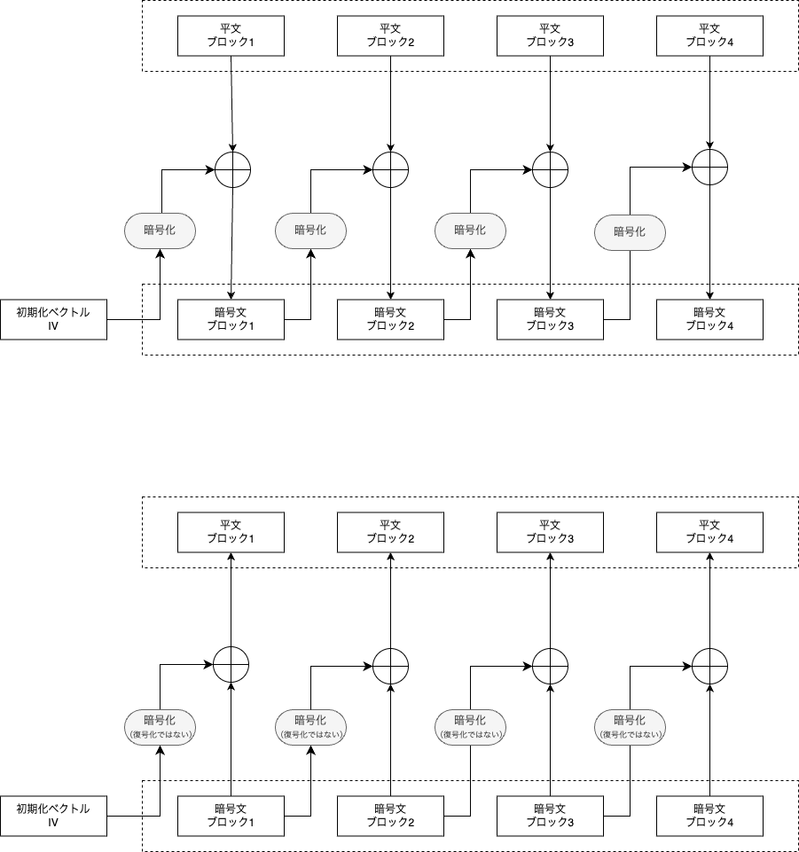

# CFB (Cipher Feedback) mode

## description
**CFB (Cipher Feedback) mode** is a mode of operation for block ciphers that allows encryption of data in units smaller than the block size. It transforms a block cipher into a self-synchronizing stream cipher. In CFB mode, the previous ciphertext block is encrypted and the output is XORed with the current plaintext block to produce the current ciphertext block. This chaining process ensures that identical plaintext blocks produce different ciphertexts, enhancing security. An initialization vector (IV) is used for the first block to add randomness and prevent identical plaintexts from encrypting to the same ciphertext. CFB mode is commonly used in applications where data arrives in varying sizes, such as network streams.

