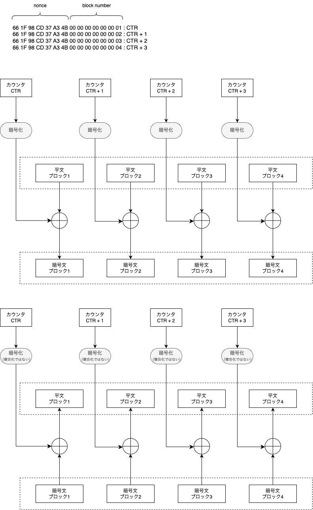

# CTR (Counter) mode

## description
**CTR (Counter) mode** is a mode of operation for block ciphers that transforms a block cipher into a stream cipher by encrypting a counter value. In CTR mode, a nonce and a counter are combined to form a unique input block, which is encrypted to produce a keystream block. This keystream is XORed with the plaintext to produce ciphertext. During decryption, the same process is used to generate the identical keystream for XORing with the ciphertext. CTR mode allows for highly parallelizable encryption and decryption, making it efficient for high-speed applications. It is widely used for its simplicity and performance, especially in environments needing large data throughput and random access to encrypted data.

