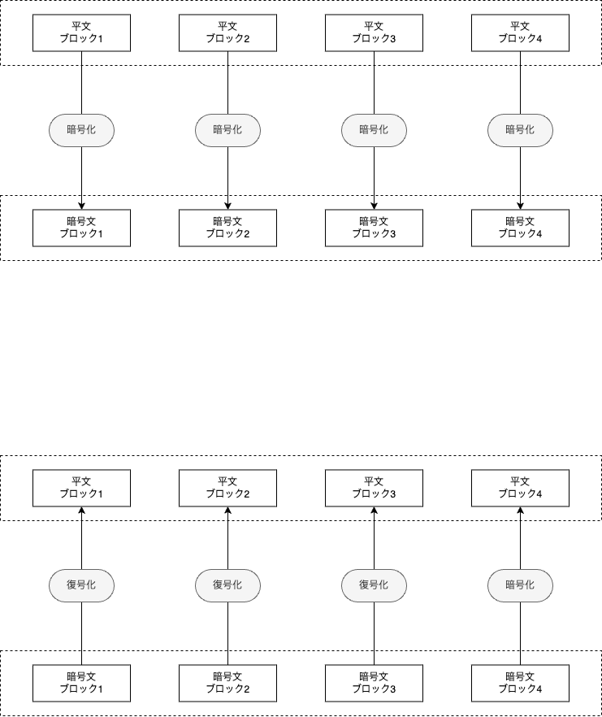

# ECB(Electric CodeBook) mode

## description
**Electronic Codebook (ECB)** mode is a simple block cipher mode of operation where each block of plaintext is encrypted independently using the same key. This means that identical plaintext blocks are encrypted into identical ciphertext blocks, which can reveal patterns in the plaintext. Due to this property, ECB is generally not recommended for use in cryptographic protocols where data confidentiality is a concern, as it does not provide serious message confidentiality.

