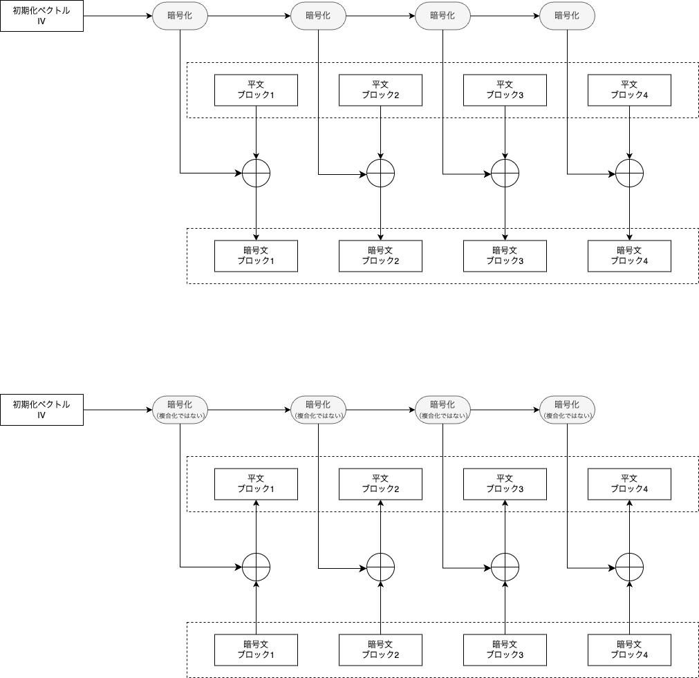

# OFB (Output Feedback) mode

## description
**OFB (Output Feedback) mode** is a mode of operation for block ciphers that converts a block cipher into a synchronous stream cipher. In OFB mode, a block cipher encrypts an initial value called the IV (Initialization Vector) to generate a keystream block, which is then XORed with the plaintext to produce the ciphertext. The output of the encryption process is fed back into itself to generate subsequent keystream blocks, ensuring that the same keystream is produced during decryption. OFB mode ensures that errors in one ciphertext block do not propagate, making it suitable for noisy communication channels. It is used in applications requiring error propagation resistance and where pre-processing of data is needed.

