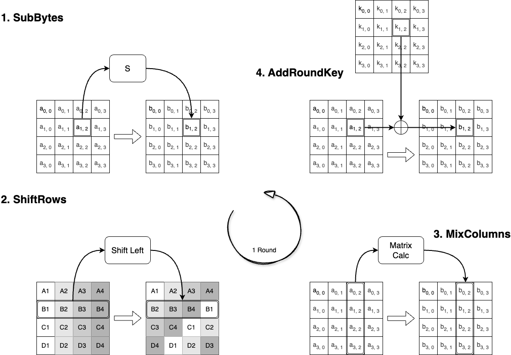

# AES(Advanced Encryption Standard)

AES (Advanced Encryption Standard) is a widely used symmetric encryption algorithm designed for securing electronic data. It operates on fixed block sizes (128 bits) and supports key lengths of 128, 192, or 256 bits, providing a balance of security and performance suitable for a broad range of applications.

## Rijndeal

Rijndeal is a symmetric encryption algorithm that is the basis of AES (Advanced Encryption Standard). It utilizes the SPN (Substitution-Permutation Network) structure which consists of multiple rounds, each including substitution layers, permutation layers, and key mixing. This design increases complexity and makes cryptanalysis more difficult.

Rijndeal uses the SPN (Substitution-Permutation Network) principle, which involves multiple rounds of these operations to ensure a high level of security. The algorithm's design balances security, efficiency, and ease of implementation, making it suitable for international standards, government agencies, and commercial encryption needs. Its security has been thoroughly analyzed, and it remains a cornerstone in cryptographic applications worldwide.

### Round

1. **SubBytes:** Substitutes each byte in the state with a corresponding byte from an S-box, introducing non-linearity and confusion.

2. **ShiftRows:** Cyclically shifts the rows of the state by a certain offset, providing diffusion by mixing the byte positions.

3. **MixColumns:** Applies a linear transformation to the columns of the state, further spreading the influence of each byte across the column for diffusion.

4. **AddRoundKey:** Combines the state with a round-specific key via XOR operation, integrating the encryption key material into the process.
