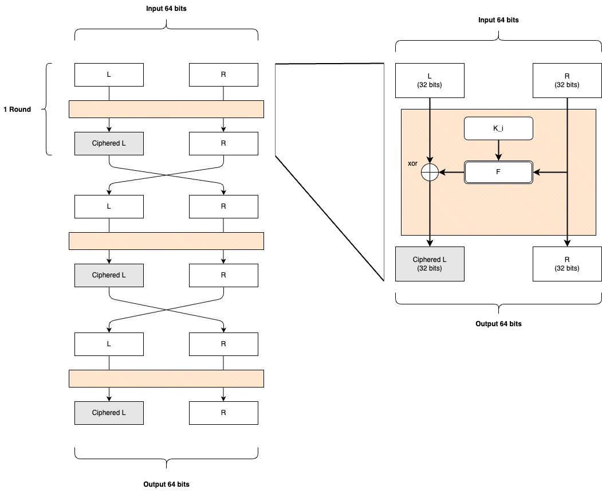

# DES (Data Encryption Standard)

## Description

The Data Encryption Standard (DES) is a widely used symmetric key encryption algorithm that was adopted as a federal standard in the United States. It encrypts data in fixed-size blocks of 64 bits using a 56-bit key. DES applies a series of complex substitutions and permutations (known as the Feistel structure) over 16 rounds to transform plaintext into ciphertext and vice versa for decryption. Although DES has been largely replaced by stronger algorithms like AES, it remains historically significant in the development of cryptography.

### Feistel structure

A Feistel round is a key component of the Feistel structure used in the DES algorithm. Each round consists of several steps:

1. **Splitting**: The 64-bit block is divided into two 32-bit halves, known as the left half (L) and the right half (R).

2. **Function Application**: A round function \( F \) is applied to the right half \( R \) and a subkey \( K_i \). The function involves expansion, substitution, and permutation operations.

3. **XOR**: The output of the function \( F \) is XORed with the left half \( L \).

4. **Swap**: The result becomes the new right half, and the old right half \( R \) becomes the new left half for the next round.

5. **Repetition**: This process is repeated for 16 rounds, each using a different subkey derived from the main key.

The Feistel structure allows for the same algorithm to be used for both encryption and decryption, simply by reversing the order of the subkeys.